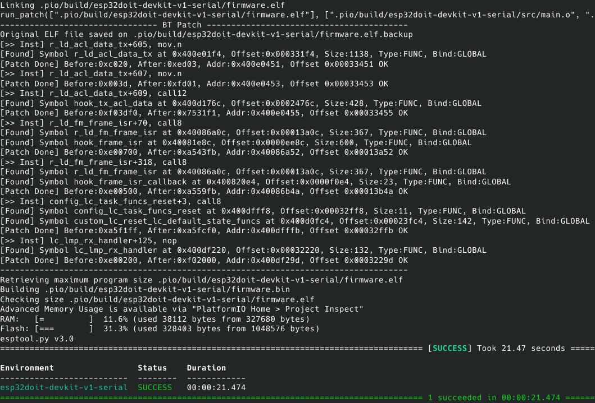

# ESP32 Firmware Patching Framework

> Streamlined methods to patch proprietary ESP32 libraries from user's code or Xtensa ELF file.
>
> TODO: Add more documentation on the patching process (UserPatch.py and rompatcher.h/s)


<!-- START doctoc generated TOC please keep comment here to allow auto update -->
<!-- DON'T EDIT THIS SECTION, INSTEAD RE-RUN doctoc TO UPDATE -->
<h5>Table of Contents</h5>

- [Requirements](#requirements)
    - [Linux/Ubuntu](#linuxubuntu)
    - [Windows 7/10](#windows-710)
- [Quick Start Template Project](#quick-start-template-project)
- [Sample Project - *Bluetooth BR/EDR* Patching](#sample-project---bluetooth-bredr-patching)
  - [Build Patched Firmware](#build-patched-firmware)
  - [Flash Firmware](#flash-firmware)
- [Framework - Patching ESP32 from Inside and Outside](#framework---patching-esp32-from-inside-and-outside)
  - [1. Patching Proprietary Libraries (Inside/Outside user code)](#1-patching-proprietary-libraries-insideoutside-user-code)
  - [2. Runtime Patching (Inside user code)](#2-runtime-patching-inside-user-code)
  - [3. ROM Patching (Inside user code)](#3-rom-patching-inside-user-code)
- [Reverse Engineering while Debugging](#reverse-engineering-while-debugging)
  - [Required Tools](#required-tools)
  - [GDB & Ghidra Live Synchronization](#gdb--ghidra-live-synchronization)

<!-- END doctoc generated TOC please keep comment here to allow auto update -->


### Requirements

This project was tested to work on the Windows 7/10 or Ubuntu 18.04, but it should work in any system that has Python 3 installed.

##### Linux/Ubuntu

Run the following to install Python 3 if you don't have it installed on your system yet:

```bash
sudo apt-get install python3
```

##### Windows 7/10

You can either manually install [Python 3](https://www.python.org/ftp/python/3.8.10/python-3.8.10-embed-amd64.zip) or run the provided batch file `requirements.bat` on the root folder of this project.

```bash
# On Windows 7/10 command prompt
requirements.bat
```

If Windows store opens when you type python on the command prompt, disable python in "App execution aliases" in settings.


### Quick Start Template Project

*TODO*


### Sample Project - *Bluetooth BR/EDR* Patching

#### Build Patched Firmware

The provided **`firmware.py`** script automates the firmware build process. Under the hood, it calls [Platformio Framework](https://docs.platformio.org/en/latest/platforms/espressif32.html) to:

***1.*** Download Xtensa toolchain, ESP-IDF SDK and openocd debugger. This can be configured on `platformio.ini`;

***2.*** Compile the main code in **`src/`** folder;

***2.*** Patch the final ELF binary via user provided patch script **`UserPatch.py`**, which uses this framework's patching library.

You can build the sample patching project for *Bluetooth BR/EDR* by running the following:

```bash
# On Linux/Ubuntu bash
python3 firmware.py build
# On Windows 7/10 command prompt
python firmware.py build
```

First time building the firmware will take some time. A successful build output should give you the following output:

<p align="center">

</p>


#### Flash Firmware

`firmware.py` provides a facility to flash the built firmware. If previous step is successful, you can flash the final patched firmware on ESP32 as follows:

```bash
# On Linux/Ubuntu bash
./firmware.py flash /dev/ttyUSB0 # Change /dev/ttyUSB0 to match your port name
# On Windows 7/10 command prompt
python firmware.py flash COM4 # Change COM4 to match your port name
```


### Framework - Patching ESP32 from Inside and Outside

*TODO*

#### 1. Patching Proprietary Libraries (Inside/Outside user code)

*TODO*

#### 2. Runtime Patching (Inside user code)

*TODO*

#### 3. ROM Patching (Inside user code)

*TODO*


### Reverse Engineering while Debugging 

#### Required Tools

*TODO*

#### GDB & Ghidra Live Synchronization

*TODO*

